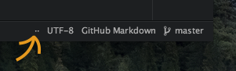
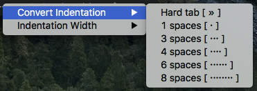

# tabulation-control

Quickly and easily change the tab length setting for a specific file to a
different setting, or even convert a file using tabs to using a specific number
of spaces all in one go.

Just the trick.
